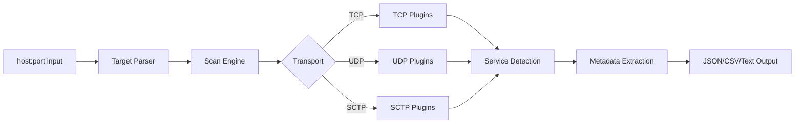

<h1 align="center">
  Nerva
  <br>
  <sub>Nerva: Fast Service Fingerprinting CLI</sub>
</h1>

<p align="center">
<a href="https://github.com/praetorian-inc/nerva/releases"></a>
<a href="https://github.com/praetorian-inc/nerva/actions"></a>
<a href="https://goreportcard.com/report/github.com/praetorian-inc/nerva"></a>
<a href="https://opensource.org/licenses/Apache-2.0"></a>
<a href="https://github.com/praetorian-inc/nerva/stargazers"></a>
</p>

<p align="center">
  <a href="#features">Features</a> •
  <a href="#installation">Installation</a> •
  <a href="#quick-start">Quick Start</a> •
  <a href="#usage">Usage</a> •
  <a href="#supported-protocols">Protocols</a> •
  <a href="#library-usage">Library</a> •
  <a href="#use-cases">Use Cases</a> •
  <a href="#troubleshooting">Troubleshooting</a>
</p>

> **High-performance service fingerprinting written in Go.** Identify 120+ network protocols across TCP, UDP, and SCTP transports with rich metadata extraction.

Nerva rapidly detects and identifies services running on open network ports. Use it alongside port scanners like [Naabu](https://github.com/projectdiscovery/naabu) to fingerprint discovered services, or integrate it into your security pipelines for automated reconnaissance.

## Features

- **120+ Protocol Plugins** — Databases, remote access, web services, messaging, industrial, and telecom protocols
- **Multi-Transport Support** — TCP (default), UDP (`--udp`), and SCTP (`--sctp`, Linux only)
- **Proxy Support** — Route scanning traffic transparently through SOCKS5 or HTTP proxies with configurable DNS resolution
- **Rich Metadata** — Extract versions, configurations, and security-relevant details from each service
- **Fast Mode** — Scan only default ports for rapid reconnaissance (`--fast`)
- **Flexible Output** — JSON, CSV, or human-readable formats
- **Pipeline Friendly** — Pipe from Naabu, Nmap, or any tool that outputs `host:port`
- **Go Library** — Import directly into your Go applications

## Installation

### Releases
Download a prebuilt binary from the [Releases](https://github.com/praetorian-inc/nerva/releases) page.

### From GitHub

```sh
go install github.com/praetorian-inc/nerva/cmd/nerva@latest
```

### From Source

```sh
git clone https://github.com/praetorian-inc/nerva.git
cd nerva
go build ./cmd/nerva
./nerva -h
```

### Docker

```sh
git clone https://github.com/praetorian-inc/nerva.git
cd nerva
docker build -t nerva .
docker run --rm nerva -h
docker run --rm nerva -t example.com:80 --json
```

## Quick Start

Fingerprint a single target:

```sh
nerva -t example.com:22
# ssh://example.com:22
```

Get detailed JSON metadata:

```sh
nerva -t example.com:22 --json
# {"host":"example.com","ip":"93.184.216.34","port":22,"protocol":"ssh","transport":"tcp","metadata":{...}}
```

Pipe from a port scanner:

```sh
naabu -host example.com -silent | nerva
# http://example.com:80
# ssh://example.com:22
# https://example.com:443
```

## Usage

```
nerva [flags]

TARGET SPECIFICATION:
  Requires host:port or ip:port format. Assumes ports are open.

EXAMPLES:
  nerva -t example.com:80
  nerva -t example.com:80,example.com:443
  nerva -l targets.txt
  nerva --json -t example.com:80
  cat targets.txt | nerva
```

### Flags

| Flag | Short | Description | Default |
|------|-------|-------------|---------|
| `--targets` | `-t` | Target or comma-separated target list | — |
| `--list` | `-l` | Input file containing targets | — |
| `--output` | `-o` | Output file path | stdout |
| `--json` | | Output in JSON format | false |
| `--csv` | | Output in CSV format | false |
| `--proxy` | | Proxy URL (e.g. socks5://127.0.0.1:1080) | — |
| `--proxy-auth` | | SOCKS5 Proxy Auth (e.g. username:password) | — |
| `--dns-order` | | DNS resolution order: `p`, `l`, `lp`, `pl` | `lp` |
| `--fast` | `-f` | Fast mode (default ports only) | false |
| `--capabilities` | `-c` | list available capabilities and exit | false |
| `--udp` | `-U` | Run UDP plugins | false |
| `--sctp` | `-S` | Run SCTP plugins (Linux only) | false |
| `--timeout` | `-w` | Timeout in milliseconds | 2000 |
| `--verbose` | `-v` | Verbose output to stderr | false |
| `--workers` | `-W` | Concurrent scan workers | 50 |
| `--max-host-conn` | `-H` | Max concurrent connections per host IP (0=unlimited) | 0 |
| `--rate-limit` | `-R` | Max scans per second globally (0=unlimited) | 0 |

### Examples

**Multiple targets:**

```sh
nerva -t example.com:22,example.com:80,example.com:443
```

**From file:**

```sh
nerva -l targets.txt --json -o results.json
```

**UDP scanning** (may require root):

```sh
sudo nerva -t example.com:53 -U
# dns://example.com:53
```

**SCTP scanning** (Linux only):

```sh
nerva -t telecom-server:3868 -S
# diameter://telecom-server:3868
```

**Fast mode** (default ports only):

```sh
nerva -l large-target-list.txt --fast --json
```

**Proxy routing with remote DNS resolution:**

```sh
nerva -t target.internal:80 --proxy socks5://127.0.0.1:1080 --dns-order p
```

**Parallel scanning with rate limiting:**

```sh
nerva -l large-target-list.txt -W 100 -H 5 -R 50 -v
```

**Graceful shutdown** (Ctrl+C returns partial results):

```sh
nerva -l huge-target-list.txt -W 50 -v
# Press Ctrl+C to stop — collected results are still printed
```

## Supported Protocols

**120+ service detection plugins** across TCP, UDP, and SCTP:

### HTTP Fingerprint Modules (24)

Technology detection for web services:

| Module | Description |
|--------|-------------|
| AnyConnect | Cisco AnyConnect SSL VPN |
| ArangoDB | Multi-model database |
| Artifactory | JFrog artifact repository |
| BigIP | F5 BIG-IP load balancer |
| ChromaDB | Vector database |
| Consul | HashiCorp service mesh |
| CouchDB | Apache document database |
| Elasticsearch | Search engine |
| etcd | Distributed key-value store |
| FortiGate | Fortinet firewall/VPN |
| GlobalProtect | Palo Alto VPN |
| Grafana | Observability platform |
| Jaeger | Distributed tracing |
| Jenkins | CI/CD automation |
| Kubernetes | Container orchestration API |
| NATS | Message broker |
| Pinecone | Vector database |
| Prometheus | Monitoring system |
| QNAP QTS | NAS management |
| SOAP | Web services |
| TeamCity | CI/CD server |
| UPnP | Universal Plug and Play |
| Vault | HashiCorp secrets management |
| WinRM | Windows Remote Management |

### Databases (20)

| Protocol | Transport | Default Ports |
|----------|-----------|---------------|
| PostgreSQL | TCP | 5432 |
| MySQL | TCP | 3306 |
| MSSQL | TCP | 1433 |
| Oracle | TCP | 1521 |
| MongoDB | TCP | 27017 |
| Redis | TCP/TLS | 6379, 6380 |
| Cassandra | TCP | 9042 |
| InfluxDB | TCP | 8086 |
| Neo4j | TCP/TLS | 7687 |
| DB2 | TCP | 446, 50000 |
| Sybase | TCP | 5000 |
| Firebird | TCP | 3050 |
| Memcached | TCP | 11211 |
| ZooKeeper | TCP | 2181 |
| Milvus | TCP | 19530, 9091 |
| CouchDB | HTTP | 5984 |
| Elasticsearch | HTTP | 9200 |
| ArangoDB | HTTP | 8529 |
| ChromaDB | HTTP | 8000 |
| Pinecone | HTTP | 443 |

### Remote Access (4)

| Protocol | Transport |
|----------|-----------|
| SSH | TCP |
| RDP | TCP |
| Telnet | TCP |
| VNC | TCP |

### Web & API (2)

| Protocol | Transport | Notes |
|----------|-----------|-------|
| HTTP/HTTPS | TCP | HTTP/2, tech detection via Wappalyzer |
| Kubernetes | TCP | API server detection |

### Messaging & Queues (10)

| Protocol | Transport | Default Ports |
|----------|-----------|---------------|
| Kafka | TCP/TLS | 9092, 9093 |
| MQTT 3/5 | TCP/TLS | 1883, 8883 |
| AMQP | TCP/TLS | 5672, 5671 |
| ActiveMQ | TCP/TLS | 61616, 61617 |
| NATS | TCP/TLS | 4222, 6222 |
| Pulsar | TCP/TLS | 6650, 6651 |
| SMTP | TCP/TLS | 25, 465, 587 |
| POP3 | TCP/TLS | 110, 995 |
| IMAP | TCP/TLS | 143, 993 |
| SMPP | TCP | 2775, 2776 |

### File & Directory Services (7)

| Protocol | Transport | Default Ports |
|----------|-----------|---------------|
| FTP | TCP | 21 |
| SMB | TCP | 445 |
| NFS | TCP/UDP | 2049 |
| Rsync | TCP | 873 |
| TFTP | UDP | 69 |
| SVN | TCP | 3690 |
| LDAP | TCP/TLS | 389, 636 |

### Network Services (10 UDP)

| Protocol | Transport |
|----------|-----------|
| DNS | TCP/UDP |
| DHCP | UDP |
| NTP | UDP |
| SNMP | UDP |
| NetBIOS-NS | UDP |
| STUN | UDP |
| OpenVPN | UDP |
| IPsec | UDP |
| IPMI | UDP |
| Echo | TCP/UDP |

### Industrial Control Systems (15)

| Protocol | Transport | Default Ports | Notes |
|----------|-----------|---------------|-------|
| Modbus | TCP | 502 | SCADA/PLC |
| S7comm | TCP | 102 | Siemens PLC |
| EtherNet/IP | TCP | 44818 | Rockwell/Allen-Bradley |
| PROFINET | TCP | 34962-34964 | Siemens industrial |
| BACnet | UDP | 47808 | Building automation |
| OPC UA | TCP | 4840 | Industrial interop |
| OMRON FINS | TCP/UDP | 9600 | OMRON PLC |
| MELSEC-Q | TCP | 5006, 5007 | Mitsubishi PLC |
| KNXnet/IP | UDP | 3671 | Building automation |
| IEC 104 | TCP | 2404 | Power grid SCADA |
| Fox | TCP | 1911 | Tridium Niagara |
| PC WORX | TCP | 1962 | Phoenix Contact |
| ProConOS | TCP | 20547 | PLC runtime |
| HART-IP | TCP | 5094 | Process automation |
| EtherCAT | UDP | 34980 | Motion control |
| Crimson v3 | TCP | 789 | Red Lion HMI |
| PCOM | TCP | 20256 | Unitronics PLC |
| GE SRTP | TCP | 18245 | GE PLC |
| ATG | TCP | 10001 | Tank gauges |

### Telecom & VoIP (15)

| Protocol | Transport | Default Ports | Notes |
|----------|-----------|---------------|-------|
| Diameter | TCP/SCTP | 3868 | LTE/5G AAA |
| M3UA | SCTP | 2905 | SS7 over IP |
| SGsAP | SCTP | 29118 | Circuit-switched fallback |
| X2AP | SCTP | 36422 | LTE inter-eNodeB |
| IUA | SCTP | 9900 | ISDN over IP |
| SIP | TCP/UDP/TLS | 5060, 5061 | VoIP signaling |
| MEGACO/H.248 | UDP | 2944, 2945 | Media gateway |
| MGCP | UDP | 2427, 2727 | Media gateway |
| H.323 | TCP | 1720 | Video conferencing |
| SCCP/Skinny | TCP | 2000, 2443 | Cisco IP phones |
| IAX2 | UDP | 4569 | Asterisk protocol |
| GTP-C | UDP | 2123 | GPRS control |
| GTP-U | UDP | 2152 | GPRS user plane |
| GTP' | UDP | 3386 | GPRS charging |
| PFCP | UDP | 8805 | 5G user plane |

### VPN & Security (10)

| Protocol | Transport | Default Ports |
|----------|-----------|---------------|
| SSH | TCP | 22, 2222 |
| OpenVPN | UDP | 1194 |
| WireGuard | UDP | 51820 |
| IPsec/IKEv2 | UDP | 500, 4500 |
| L2TP | UDP | 1701 |
| GlobalProtect | HTTP | 443 |
| AnyConnect | HTTP | 443 |
| FortiGate | HTTP | 443 |
| STUN/TURN | UDP | 3478, 5349 |
| Kerberos | TCP | 88 |

### Remote Access & Management (10)

| Protocol | Transport | Default Ports |
|----------|-----------|---------------|
| RDP | TCP/TLS | 3389 |
| VNC | TCP | 5900 |
| Telnet | TCP | 23 |
| WinRM | HTTP | 5985, 5986 |
| IPMI | UDP | 623 |
| SNMP | UDP | 161 |
| Zabbix Agent | TCP | 10050 |
| NRPE | TCP/TLS | 5666 |
| Docker | TCP/TLS | 2375, 2376 |
| X11 | TCP | 6000-6063 |

### Developer Tools (8)

| Protocol | Transport | Default Ports |
|----------|-----------|---------------|
| HTTP/HTTPS | TCP | 80, 443, 8080, 8443 |
| Java RMI | TCP | 1099 |
| JDWP | TCP | 5005 |
| RTSP | TCP | 554 |
| Linux RPC | TCP | 111 |
| JetDirect | TCP | 9100 |
| CUPS/IPP | TCP | 631 |
| SonarQube | TCP | 9000 |

## Library Usage

Import Nerva into your Go applications:

```go
package main

import (
    "context"
    "fmt"
    "log"
    "net/netip"
    "time"

    "github.com/praetorian-inc/nerva/pkg/plugins"
    "github.com/praetorian-inc/nerva/pkg/scan"
)

func main() {
    // Configure scan
    config := scan.Config{
        DefaultTimeout: 2 * time.Second,
        FastMode:       false,
        UDP:            false,
        Proxy:          "socks5://127.0.0.1:1080", // optional
        ProxyAuth:      "username:password",       // optional
        DNSOrder:       "p",                       // resolver strategy
    }

    // Create target
    ip, _ := netip.ParseAddr("93.184.216.34")
    target := plugins.Target{
        Address: netip.AddrPortFrom(ip, 22),
        Host:    "example.com",
    }

    // Run scan
    results, err := scan.ScanTargets(context.Background(), []plugins.Target{target}, config)
    if err != nil {
        log.Fatal(err)
    }

    // Process results
    for _, result := range results {
        fmt.Printf("%s:%d - %s (%s)\n",
            result.Host, result.Port,
            result.Protocol, result.Transport)
    }
}
```

See [examples/service-fingerprinting-example.go](examples/service-fingerprinting-example.go) for a complete working example.

## Use Cases

### Penetration Testing

Rapidly fingerprint services discovered during reconnaissance to identify potential attack vectors.

### Asset Discovery Pipelines

Combine with Naabu or Masscan for large-scale asset inventory:

```sh
naabu -host 10.0.0.0/24 -silent | nerva --json | jq '.protocol'
```

### CI/CD Security Scanning

Integrate into deployment pipelines to verify only expected services are exposed.

### Bug Bounty Reconnaissance

Quickly enumerate services across scope targets to find interesting endpoints.

### Telecom Network Analysis

Fingerprint Diameter nodes in LTE/5G networks using SCTP transport (Linux):

```sh
nerva -t mme.telecom.local:3868 -S --json
```

## Architecture



## Why Nerva?

### vs Nmap

- **Smarter defaults**: Nerva checks the most likely protocol first based on port number
- **Structured output**: Native JSON/CSV support for easy parsing and pipeline integration
- **Focused**: Service fingerprinting only — pair with dedicated port scanners for discovery

### vs zgrab2

- **Auto-detection**: No need to specify protocol ahead of time
- **Simpler usage**: `nerva -t host:port` vs `echo host | zgrab2 http -p port`

## Troubleshooting

### No output

**Cause**: Port is closed or no supported service detected.

**Solution**: Verify the port is open:

```sh
nc -zv example.com 80
```

### Timeout errors

**Cause**: Default 2-second timeout too short for slow services.

**Solution**: Increase timeout:

```sh
nerva -t example.com:80 -w 5000  # 5 seconds
```

### UDP services not detected

**Cause**: UDP scanning disabled by default.

**Solution**: Enable with `-U` flag (may require root):

```sh
sudo nerva -t example.com:53 -U
```

### SCTP not working

**Cause**: SCTP only supported on Linux.

**Solution**: Run on a Linux system or container:

```sh
docker run --rm nerva -t telecom:3868 -S
```

## Terminology

- **Service**: A network service running on a port (SSH, HTTP, PostgreSQL, etc.)
- **Fingerprinting**: Detecting and identifying the service type, version, and configuration
- **Plugin**: A protocol-specific detection module
- **Fast Mode**: Scanning only the default port for each protocol (80/20 optimization)
- **Transport**: Network layer protocol (TCP, UDP, or SCTP)

## Support

If you find Nerva useful, please consider giving it a star:

[](https://github.com/praetorian-inc/nerva)

## Contributing

We welcome contributions! See [CONTRIBUTING.md](CONTRIBUTING.md) for guidelines.

## License

Apache 2.0 — see [LICENSE](LICENSE) for details.

## Acknowledgements

Nerva is a maintained fork of [fingerprintx](https://github.com/praetorian-inc/fingerprintx), originally developed by Praetorian's intern class of 2022:

* [Soham Roy](https://github.com/praetorian-sohamroy)
* [Jue Huang](https://github.com/jue-huang)
* [Henry Jung](https://github.com/henryjung64)
* [Tristan Wiesepape](https://github.com/qwetboy10)
* [Joseph Henry](https://github.com/jwhenry28)
* [Noah Tutt](https://github.com/noahtutt)
* [Nathan Sportsman](https://github.com/nsportsman)
