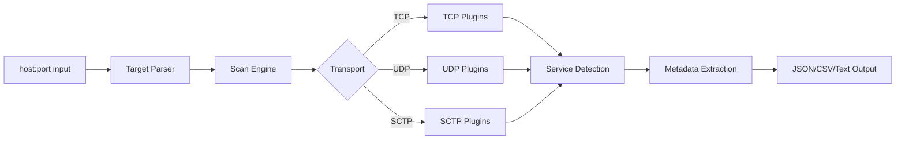

<h1 align="center">
  Nerva
  <br>
  <sub>Fast Service Fingerprinting CLI</sub>
</h1>

<p align="center">
<a href="https://github.com/praetorian-inc/nerva/releases"></a>
<a href="https://github.com/praetorian-inc/nerva/actions"></a>
<a href="https://goreportcard.com/report/github.com/praetorian-inc/nerva"></a>
<a href="https://opensource.org/licenses/Apache-2.0"></a>
<a href="https://github.com/praetorian-inc/nerva/stargazers"></a>
</p>

<p align="center">
  <a href="#features">Features</a> •
  <a href="#installation">Installation</a> •
  <a href="#quick-start">Quick Start</a> •
  <a href="#usage">Usage</a> •
  <a href="#supported-protocols">Protocols</a> •
  <a href="#library-usage">Library</a> •
  <a href="#use-cases">Use Cases</a> •
  <a href="#troubleshooting">Troubleshooting</a>
</p>

> **High-performance service fingerprinting written in Go.** Identify 54 network protocols across TCP, UDP, and SCTP transports with rich metadata extraction.

Nerva rapidly detects and identifies services running on open network ports. Use it alongside port scanners like [Naabu](https://github.com/projectdiscovery/naabu) to fingerprint discovered services, or integrate it into your security pipelines for automated reconnaissance.

## Features

- **54 Protocol Plugins** — Databases, remote access, web services, messaging, industrial, and telecom protocols
- **Multi-Transport Support** — TCP (default), UDP (`--udp`), and SCTP (`--sctp`, Linux only)
- **Rich Metadata** — Extract versions, configurations, and security-relevant details from each service
- **Fast Mode** — Scan only default ports for rapid reconnaissance (`--fast`)
- **Flexible Output** — JSON, CSV, or human-readable formats
- **Pipeline Friendly** — Pipe from Naabu, Nmap, or any tool that outputs `host:port`
- **Go Library** — Import directly into your Go applications

## Installation

### From GitHub

```sh
go install github.com/praetorian-inc/nerva/cmd/nerva@latest
```

### From Source

```sh
git clone https://github.com/praetorian-inc/nerva.git
cd nerva
go build ./cmd/nerva
./nerva -h
```

### Docker

```sh
git clone https://github.com/praetorian-inc/nerva.git
cd nerva
docker build -t nerva .
docker run --rm nerva -h
docker run --rm nerva -t example.com:80 --json
```

## Quick Start

Fingerprint a single target:

```sh
nerva -t example.com:22
# ssh://example.com:22
```

Get detailed JSON metadata:

```sh
nerva -t example.com:22 --json
# {"host":"example.com","ip":"93.184.216.34","port":22,"protocol":"ssh","transport":"tcp","metadata":{...}}
```

Pipe from a port scanner:

```sh
naabu -host example.com -silent | nerva
# http://example.com:80
# ssh://example.com:22
# https://example.com:443
```

## Usage

```
nerva [flags]

TARGET SPECIFICATION:
  Requires host:port or ip:port format. Assumes ports are open.

EXAMPLES:
  nerva -t example.com:80
  nerva -t example.com:80,example.com:443
  nerva -l targets.txt
  nerva --json -t example.com:80
  cat targets.txt | nerva
```

### Flags

| Flag | Short | Description | Default |
|------|-------|-------------|---------|
| `--targets` | `-t` | Target or comma-separated target list | — |
| `--list` | `-l` | Input file containing targets | — |
| `--output` | `-o` | Output file path | stdout |
| `--json` | | Output in JSON format | false |
| `--csv` | | Output in CSV format | false |
| `--fast` | `-f` | Fast mode (default ports only) | false |
| `--udp` | `-U` | Run UDP plugins | false |
| `--sctp` | `-S` | Run SCTP plugins (Linux only) | false |
| `--timeout` | `-w` | Timeout in milliseconds | 2000 |
| `--verbose` | `-v` | Verbose output to stderr | false |

### Examples

**Multiple targets:**

```sh
nerva -t example.com:22,example.com:80,example.com:443
```

**From file:**

```sh
nerva -l targets.txt --json -o results.json
```

**UDP scanning** (may require root):

```sh
sudo nerva -t example.com:53 -U
# dns://example.com:53
```

**SCTP scanning** (Linux only):

```sh
nerva -t telecom-server:3868 -S
# diameter://telecom-server:3868
```

**Fast mode** (default ports only):

```sh
nerva -l large-target-list.txt --fast --json
```

## Supported Protocols

**54 service detection plugins** across TCP, UDP, and SCTP:

### Databases (18)

| Protocol | Transport | Notes |
|----------|-----------|-------|
| PostgreSQL | TCP | Auth detection, version |
| MySQL | TCP | Version, error codes |
| MSSQL | TCP | Instance detection |
| OracleDB | TCP | TNS protocol |
| MongoDB | TCP | Wire protocol version |
| Redis | TCP | Auth detection |
| Cassandra | TCP | CQL protocol |
| CouchDB | TCP | HTTP-based |
| Elasticsearch | TCP | Cluster info |
| InfluxDB | TCP | HTTP API |
| Neo4j | TCP | Bolt protocol |
| DB2 | TCP | DRDA protocol |
| Sybase | TCP | TDS protocol |
| Firebird | TCP | Wire protocol |
| Memcached | TCP | Text/binary protocol |
| **ChromaDB** | TCP | Vector database |
| **Milvus** | TCP | Vector database |
| **Pinecone** | TCP | Vector database |

### Remote Access (4)

| Protocol | Transport |
|----------|-----------|
| SSH | TCP |
| RDP | TCP |
| Telnet | TCP |
| VNC | TCP |

### Web & API (2)

| Protocol | Transport | Notes |
|----------|-----------|-------|
| HTTP/HTTPS | TCP | HTTP/2, tech detection via Wappalyzer |
| Kubernetes | TCP | API server detection |

### Messaging (5)

| Protocol | Transport | Notes |
|----------|-----------|-------|
| Kafka | TCP | Old and new protocol |
| MQTT | TCP | MQTT 3 and 5 |
| SMTP/SMTPS | TCP | Banner detection |
| POP3/POP3S | TCP | Banner detection |
| IMAP/IMAPS | TCP | Banner detection |

### File Transfer (3)

| Protocol | Transport |
|----------|-----------|
| FTP | TCP |
| SMB | TCP |
| Rsync | TCP |

### Directory Services (2)

| Protocol | Transport |
|----------|-----------|
| LDAP | TCP |
| LDAPS | TCP |

### Network Services (10 UDP)

| Protocol | Transport |
|----------|-----------|
| DNS | TCP/UDP |
| DHCP | UDP |
| NTP | UDP |
| SNMP | UDP |
| NetBIOS-NS | UDP |
| STUN | UDP |
| OpenVPN | UDP |
| IPsec | UDP |
| IPMI | UDP |
| Echo | TCP/UDP |

### Industrial & Telecom (4)

| Protocol | Transport | Notes |
|----------|-----------|-------|
| Modbus | TCP | Industrial control |
| IPMI | UDP | Server management |
| Diameter | TCP | 3GPP/LTE/5G AAA |
| **Diameter-SCTP** | SCTP | Telecom (Linux only) |
| SMPP | TCP | SMS gateway |

### Developer Tools (4)

| Protocol | Transport |
|----------|-----------|
| JDWP | TCP |
| Java RMI | TCP |
| RTSP | TCP |
| Linux RPC | TCP |

## Library Usage

Import Nerva into your Go applications:

```go
package main

import (
    "fmt"
    "log"
    "net/netip"
    "time"

    "github.com/praetorian-inc/nerva/pkg/plugins"
    "github.com/praetorian-inc/nerva/pkg/scan"
)

func main() {
    // Configure scan
    config := scan.Config{
        DefaultTimeout: 2 * time.Second,
        FastMode:       false,
        UDP:            false,
    }

    // Create target
    ip, _ := netip.ParseAddr("93.184.216.34")
    target := plugins.Target{
        Address: netip.AddrPortFrom(ip, 22),
        Host:    "example.com",
    }

    // Run scan
    results, err := scan.ScanTargets([]plugins.Target{target}, config)
    if err != nil {
        log.Fatal(err)
    }

    // Process results
    for _, result := range results {
        fmt.Printf("%s:%d - %s (%s)\n",
            result.Host, result.Port,
            result.Protocol, result.Transport)
    }
}
```

See [examples/service-fingerprinting-example.go](examples/service-fingerprinting-example.go) for a complete working example.

## Use Cases

### Penetration Testing

Rapidly fingerprint services discovered during reconnaissance to identify potential attack vectors.

### Asset Discovery Pipelines

Combine with Naabu or Masscan for large-scale asset inventory:

```sh
naabu -host 10.0.0.0/24 -silent | nerva --json | jq '.protocol'
```

### CI/CD Security Scanning

Integrate into deployment pipelines to verify only expected services are exposed.

### Bug Bounty Reconnaissance

Quickly enumerate services across scope targets to find interesting endpoints.

### Telecom Network Analysis

Fingerprint Diameter nodes in LTE/5G networks using SCTP transport (Linux):

```sh
nerva -t mme.telecom.local:3868 -S --json
```

## Architecture



## Why Nerva?

### vs Nmap

- **Smarter defaults**: Nerva checks the most likely protocol first based on port number
- **Structured output**: Native JSON/CSV support for easy parsing and pipeline integration
- **Focused**: Service fingerprinting only — pair with dedicated port scanners for discovery

### vs zgrab2

- **Auto-detection**: No need to specify protocol ahead of time
- **Simpler usage**: `nerva -t host:port` vs `echo host | zgrab2 http -p port`

## Troubleshooting

### No output

**Cause**: Port is closed or no supported service detected.

**Solution**: Verify the port is open:

```sh
nc -zv example.com 80
```

### Timeout errors

**Cause**: Default 2-second timeout too short for slow services.

**Solution**: Increase timeout:

```sh
nerva -t example.com:80 -w 5000  # 5 seconds
```

### UDP services not detected

**Cause**: UDP scanning disabled by default.

**Solution**: Enable with `-U` flag (may require root):

```sh
sudo nerva -t example.com:53 -U
```

### SCTP not working

**Cause**: SCTP only supported on Linux.

**Solution**: Run on a Linux system or container:

```sh
docker run --rm nerva -t telecom:3868 -S
```

## Terminology

- **Service**: A network service running on a port (SSH, HTTP, PostgreSQL, etc.)
- **Fingerprinting**: Detecting and identifying the service type, version, and configuration
- **Plugin**: A protocol-specific detection module
- **Fast Mode**: Scanning only the default port for each protocol (80/20 optimization)
- **Transport**: Network layer protocol (TCP, UDP, or SCTP)

## Support

If you find Nerva useful, please consider giving it a star:

[](https://github.com/praetorian-inc/nerva)

## Contributing

We welcome contributions! See [CONTRIBUTING.md](CONTRIBUTING.md) for guidelines.

## License

Apache 2.0 — see [LICENSE](LICENSE) for details.

## Acknowledgements

Nerva is a maintained fork of [fingerprintx](https://github.com/praetorian-inc/fingerprintx), originally developed by Praetorian's intern class of 2022:

* [Soham Roy](https://github.com/praetorian-sohamroy)
* [Jue Huang](https://github.com/jue-huang)
* [Henry Jung](https://github.com/henryjung64)
* [Tristan Wiesepape](https://github.com/qwetboy10)
* [Joseph Henry](https://github.com/jwhenry28)
* [Noah Tutt](https://github.com/noahtutt)
* [Nathan Sportsman](https://github.com/nsportsman)
